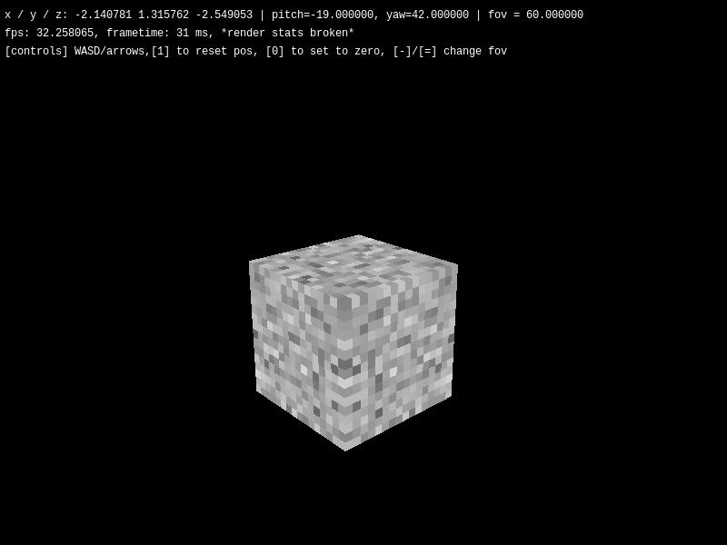

# hl craft

Майнкрафт но software render. Название такое ибо вдохновился опцией "Software render" из первой халвы.
Потом мб поменяю.

Кстати часть кода написал гпт, но и наверное ок. Скажите спасибо, что это не 100% вайбкод.



## Сборка

Зависимости: `libwayland`, `xkbcommon` и `cairo`. Как скачать у грока спросите.

```console
$ cmake -B build -G Ninja -DCMAKE_BUILD_TYPE=Release && ninja -C build
```

Экзешник будет в `build/hl-craft`.

В `cmake` можно ещё прокинуть `-DBUILD_STATIC=ON`, оно стаически слинкует все доп. либы (libwayland и прочее не затронет), что я тут юзаю. Неудобно
для дебага, но для релиза самое то.

Пока поддерживается только вл, мб добавлю иксы. Также поддерживается винда, если у вас есть WSL и так реализовали вл.

